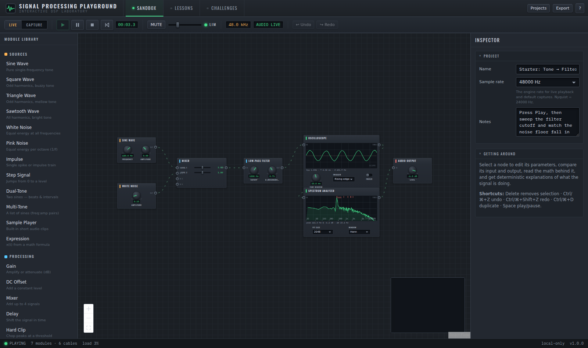
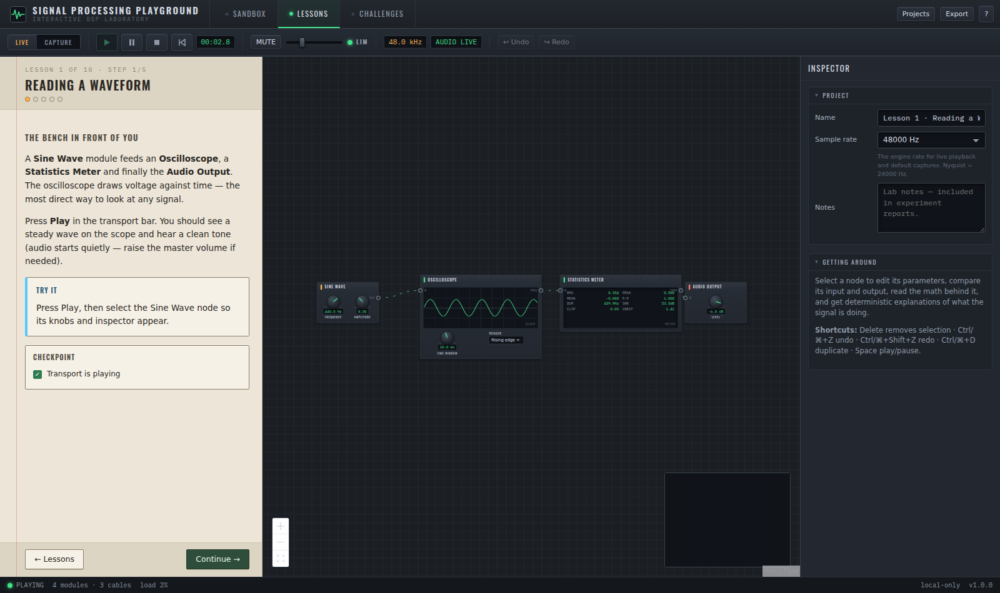
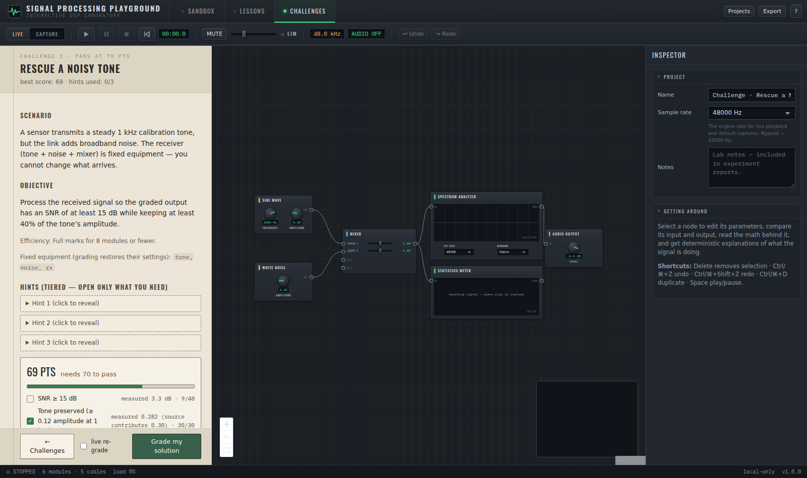

# Signal Processing Playground

An interactive, fully client-side **laboratory for learning digital signal processing**.
Patch modules together on a node canvas, listen to the result through a safety-limited
audio engine, inspect signals with oscilloscope / spectrum / spectrogram / statistics
instruments, follow a ten-lesson guided course, and solve eight measurably-graded
engineering challenges — all in the browser, with no backend, no account and no API keys.



| Guided lessons | Graded challenges |
| --- | --- |
|  |  |

## What it is (and is not)

This is an **educational engineering tool** for engineering students and technically
curious developers. It is mathematically careful — real biquad filters, a real FFT,
deterministic seeded captures, honest measurement labels — but it is *not* a replacement
for MATLAB, Simulink, GNU Radio or laboratory instrumentation, and it makes no claim of
numerical or regulatory equivalence with professional tools. Deliberate simplifications
are documented in [docs/DSP_NOTES.md](docs/DSP_NOTES.md).

## Features

**Node laboratory**

- 35 modules: 12 sources (sine/square/triangle/saw, white & pink noise, impulse, step,
  dual-tone, multi-tone, sample player, sandboxed math expression), 18 processors
  (gain, DC offset, 4-input mixer, delay, hard clip, saturation, quantizer, bit depth,
  resampler with switchable anti-aliasing, LP/HP/BP/notch biquads, moving average,
  AM & FM modulators, FFT convolution with five built-in impulse responses, feedback
  delay), 4 analyzers and the safety-limited audio output
- Left-to-right signal flow with branching, merging, analyzer taps that never alter the
  signal, visually distinct modulation inputs (square jacks) and feedback ports (dashed)
- Connection validation with explanations; instantaneous cycles are blocked — feedback is
  legal only through the Feedback Delay's one-block-delayed Loop In port
- Tactile knobs/sliders/switches on the modules plus an inspector with exact numeric
  entry, units, ranges, validation, reset, before/after views and per-node math

**Two operating modes**

- **Live**: continuous rendering, audible playback, oscilloscope-style observation
- **Capture**: finite, seed-deterministic renders for precise analysis, repeatable
  challenge grading, and WAV/CSV export

**Instruments**

- Oscilloscope (time window, trigger modes/level, Y scale, sample dots at high zoom)
- Spectrum analyzer (FFT size 256–16384, four windows, log/linear axes, dB/linear)
- Spectrogram (window size, overlap, legend) and statistics meter (mean, min/max, peak,
  peak-to-peak, RMS, crest factor, dominant frequency, SNR estimate, clipping %, ZCR)
- A compact before/after comparison appears for any selected processing node

**Learning**

- Ten-lesson course: waveforms → superposition → sampling/aliasing → spectrum → noise &
  SNR → filtering → clipping & quantization → AM → FM → convolution. Each lesson has
  prediction checkpoints, live measurable goals, and expandable KaTeX math
- Eight challenges graded deterministically on real measurements (SNR, frequency error,
  correlation, clipping %, band energy, node count) with tiered hints and score
  breakdowns — multiple different solutions pass, and the test suite proves it
- A deterministic **Explain This Signal** panel (no AI, no chatbot) that cites measured
  values and distinguishes measured facts / heuristics / suggestions

**Persistence & export**

- Autosaved named projects, duplicate/delete/rename, built-in examples, versioned JSON
  export/import with schema validation, compressed share URLs (with size warnings)
- WAV (16-bit), CSV, analyzer PNGs, signal-chain diagram PNG, and a self-contained
  printable HTML experiment report

## Technology

Vite · React 18 · TypeScript (strict) · @xyflow/react (node canvas) · zustand (state) ·
zod (schemas) · KaTeX (math) · lz-string (share URLs) · html-to-image (diagram export) ·
Web Audio (AudioWorklet playback with limiter + hard clip) · Web Workers (capture
rendering) · Canvas 2D (instrument rendering) · Vitest (unit/integration) · Playwright
(browser tests). All DSP is hand-written typed-array code in `src/engine` — no runtime
DSP dependency, no eval, no network calls.

## Getting started

```bash
npm install
npm run dev          # development server (http://localhost:5173)
```

### Commands

| Command | Purpose |
| --- | --- |
| `npm run dev` | Development server with HMR |
| `npm run build` | Type-check + production build into `dist/` |
| `npm run preview` | Serve the production build locally |
| `npm run typecheck` | TypeScript project check |
| `npm run lint` | ESLint over `src` and `tests` |
| `npm run format` | Prettier write |
| `npm test` | Vitest unit + integration suites (144 tests) |
| `npm run test:e2e` | Playwright browser suite (14 scenarios) |
| `npm run validate` | typecheck + lint + tests + build |

## Deployment (static)

The app is plain static files. Build and host `dist/` anywhere:

```bash
npm run build                                  # deploy at any origin root
BASE_PATH=/my/sub/path/ npm run build          # deploy under a sub-path
```

The default base is `./` (relative), so the build also works from a file share or any
sub-path without configuration. For GitHub Pages: build with
`BASE_PATH=/<repo-name>/` and publish `dist/`.

## Browser support

- **Chrome / Edge (current)** — primary targets, fully supported
- **Firefox (current)** — supported
- **Safari (desktop, current)** — supported with graceful degradation: if a requested
  sample rate is refused the context falls back to the device rate, and if AudioWorklet
  is unavailable the app says so and continues with visual simulation only
- Screens below 900×500 get a clear "needs a desktop display" message rather than a
  broken layout. Mobile is intentionally unsupported.

## Architecture overview

Ten systems with strict separation (details in [docs/ARCHITECTURE.md](docs/ARCHITECTURE.md)):

1. **Project/graph model** (`src/model`) — typed, zod-validated, versioned schemas
2. **DSP engine** (`src/engine`) — pure TypeScript block runner; deterministic
   topological evaluation; feedback only via one-block-deferred edges
3. **Live engine** (`src/engine/live.ts`) — real-time block scheduler feeding per-node
   ring buffers and the audio sink
4. **Capture engine** (`src/engine/capture.ts` + worker) — finite seeded renders
5. **Visualization** (`src/viz`) — canvas plotting kit shared by nodes, inspector and
   PNG export
6. **Lesson/challenge engine** (`src/learn`) — declarative content, measurable goals,
   deterministic grading
7. **Persistence & sharing** (`src/state/persist.ts`, `src/export/share.ts`)
8. **Export & reporting** (`src/export`)
9. **Deterministic explanation** (`src/explain`)
10. **UI & visual system** (`src/components`, `src/styles`) — React components contain
    no DSP; they call engine helpers and draw

## Audio safety

Audio **never starts by itself**: an AudioContext is created only inside the Play
gesture. The output chain is worklet → master gain (default 25%) → DynamicsCompressor
limiter → hard ±1 clip → destination. Parameter changes are smoothed to avoid clicks,
the limiter LED shows when it is actively reducing gain, and the Explain panel warns
about clipping, DC and out-of-audible-range content. Suspension/resume (e.g. tab
switching) is handled; visual simulation continues when audio is off or unavailable.

## Project file format

Projects export as versioned JSON (`format: "signal-processing-playground/project"`,
current schema version 1) containing nodes, cables, parameters, sample rate and notes.
Import validates with zod, applies migrations for older versions, removes unknown node
types with warnings, clamps out-of-range parameters, and reports actionable errors for
corrupted files. See [docs/ARCHITECTURE.md](docs/ARCHITECTURE.md#persistence).

## Documentation

- [docs/IMPLEMENTATION_PLAN.md](docs/IMPLEMENTATION_PLAN.md) — milestones and status
- [docs/ARCHITECTURE.md](docs/ARCHITECTURE.md) — systems, data flow, decisions
- [docs/DSP_NOTES.md](docs/DSP_NOTES.md) — algorithms, fidelity, honest limitations
- [docs/LESSON_DESIGN.md](docs/LESSON_DESIGN.md) — pedagogy and lesson structure
- [docs/CHALLENGE_GRADING.md](docs/CHALLENGE_GRADING.md) — grading design and criteria
- [docs/TESTING.md](docs/TESTING.md) — test strategy and how to run everything
- [docs/ASSETS.md](docs/ASSETS.md) — external assets and licenses

## Contributing

- Keep DSP out of React components — engine code lives in `src/engine` and must run in
  workers and tests unchanged
- New node types: add a `NodeDef` (ports, params, math, process) and register it in
  `src/engine/registry.ts`; add unit tests for its numerical behaviour
- Run `npm run validate` and `npm run test:e2e` before proposing changes
- Schema changes require a version bump plus a migration in `src/model/schema.ts`

## License

MIT (application code). Bundled fonts: Oswald & IBM Plex Mono under the SIL Open Font
License via Fontsource; KaTeX under MIT. See [docs/ASSETS.md](docs/ASSETS.md).
